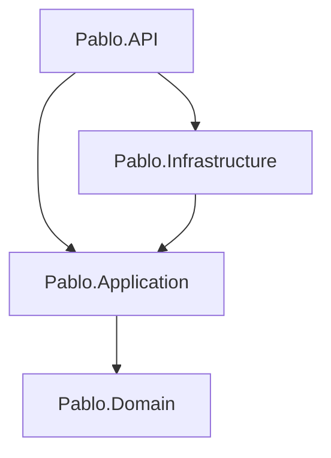

# AGENTS.md

Project-specific guidance for AI coding agents working on the Pablo .NET backend.

Frontend (React / Astryx) rules live in `pablo-web/AGENTS.md`.

## Architecture

Clean Architecture under `pablo/`. Four projects in `pablo.slnx`; dependencies point **inward only**.

```
Pablo.Domain          → (none)
Pablo.Application     → Domain
Pablo.Infrastructure  → Application
Pablo.API             → Application + Infrastructure
```



| Project | Role |
|---------|------|
| `src/Pablo.Domain` | Entities, value objects, domain events, repository/port interfaces |
| `src/Pablo.Application` | Application services / use cases, DTOs, validators, application interfaces |
| `src/Pablo.Infrastructure` | EF/DbContext, repository implementations, external clients |
| `src/Pablo.API` | Controllers, middleware, `Program.cs` DI composition root |
| `tests/` | Reserved for `Pablo.*.Tests` (none yet) |

**Not CQRS yet.** Use plain application services. Do not add MediatR, Commands, Queries, or Handlers unless asked. CQRS may come later.

## Dependency rules (hard)

- Depend inward only. Never add a ProjectReference that points outward.
- Domain: no persistence, HTTP, or framework packages for infrastructure concerns.
- API may reference Infrastructure **only** for DI registration (e.g. `AddInfrastructure`).
- Controllers call Application services — never Infrastructure types directly.
- No business rules in API or Infrastructure.

## What file goes where

### Domain — by type

```
Pablo.Domain/
  Entities/
  ValueObjects/
  Enums/
  Interfaces/          # ports, e.g. IUserRepository
```

### Application — by feature

```
Pablo.Application/
  Features/{Name}/     # services, DTOs, validators for that feature
  DependencyInjection.cs   # AddApplication()
```

No `Commands/`, `Queries/`, or `Handlers/` folders until CQRS is introduced.

### Infrastructure — by technical concern

```
Pablo.Infrastructure/
  Persistence/         # DbContext, entity configs, repository implementations
  External/            # third-party API clients, email, storage, etc.
  DependencyInjection.cs   # AddInfrastructure(IConfiguration)
```

### API — host and HTTP surface

```
Pablo.API/
  Controllers/
  Middleware/          # when needed
  Program.cs           # composition root: AddApplication + AddInfrastructure
  appsettings.json
  appsettings.Development.json
```

### Tests (when added)

```
pablo/tests/Pablo.Domain.Tests/
pablo/tests/Pablo.Application.Tests/
pablo/tests/Pablo.API.Tests/       # integration, if needed
```

## Workflow for a new feature

1. Domain — entities / value objects / port interfaces
2. Application — feature service + DTOs (+ validators when used)
3. Infrastructure — implement ports (repos, external clients)
4. API — controller that depends on Application services only
5. Register in `AddApplication()` / `AddInfrastructure()` and call both from `Program.cs`

## Tooling

From repo root:

- `make build` — build the solution
- `make test` — run tests
- `make format` — `dotnet format` (+ frontend Biome)
- `make run` / `make watch` — run the API

Follow `.editorconfig`: PascalCase types, `I` + PascalCase interfaces, `_camelCase` private fields, file-scoped namespaces, namespaces match folders.

## Self-check before finishing

- [ ] ProjectReferences still point inward only
- [ ] No EF / HTTP / Infrastructure types in Domain
- [ ] Controllers have no business logic and do not touch Infrastructure
- [ ] New types live in the folders above; namespaces match folders
- [ ] No CQRS / MediatR scaffolding unless explicitly requested
