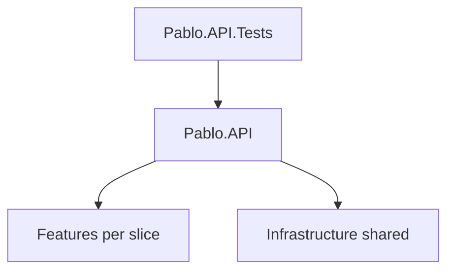

# AGENTS.md

Project-specific guidance for AI coding agents working on the Pablo .NET backend.

Frontend (React / Astryx) rules live in `pablo-web/AGENTS.md`.

## Architecture

Single API project under `pablo/`. Features are vertical slices in `Features/{Name}/`; shared EF/Identity lives in `Infrastructure/`.

```
Pablo.API
Pablo.API.Tests
```



| Location | Role |
|----------|------|
| `src/Pablo.API` | Host, HTTP surface, features, shared infrastructure |
| `src/Pablo.API/Features/{Name}/` | One subfolder per feature (controllers, services, DTOs, validators) |
| `src/Pablo.API/Infrastructure/` | DbContext, migrations, Identity, external clients, `AddInfrastructure` |
| `tests/Pablo.API.Tests` | Integration tests via `WebApplicationFactory` (`PabloApiFactory`) |

**Not CQRS yet.** Use plain feature services. Do not add MediatR, Commands, Queries, or Handlers unless asked. CQRS may come later.

## Dependency rules (hard)

- Keep a **single** class library/project: `Pablo.API`. Do not add Domain / Application / Infrastructure projects unless asked.
- Feature code goes under `Features/{Name}/`. Shared persistence and Identity go under `Infrastructure/`.
- Controllers call feature services — keep business rules out of controllers.
- Namespaces match folders (`Pablo.API.Features.{Name}.*`, `Pablo.API.Infrastructure.*`).

## What file goes where

### Features — by feature

```
Pablo.API/
  Features/{Name}/
    {Name}Controller.cs    # or endpoints
    {Name}Service.cs       # application logic for the feature
    # DTOs, validators as needed
```

No `Commands/`, `Queries/`, or `Handlers/` folders until CQRS is introduced.

### Infrastructure — shared technical concerns

```
Pablo.API/
  Infrastructure/
    Persistence/           # DbContext, entity configs, migrations
    Identity/              # Identity user types
    External/              # third-party API clients, email, storage (when needed)
    DependencyInjection.cs # AddInfrastructure(IConfiguration)
```

### Host and HTTP surface

```
Pablo.API/
  Middleware/              # when needed
  Program.cs               # composition root: AddInfrastructure (+ feature DI)
  appsettings.json
  appsettings.Development.json
```

### Tests

See [`tests/Pablo.API.Tests/README.md`](tests/Pablo.API.Tests/README.md).

**Hard rule:** test folders mirror the API. Feature tests live under `Features/{Name}/` with the same `{Name}` as `src/Pablo.API/Features/{Name}/`. Namespaces match folders (`Pablo.API.Tests.Features.{Name}`).

```
pablo/tests/Pablo.API.Tests/
  PabloApiFactory.cs          # WebApplicationFactory; swaps EF to InMemory
  HealthEndpointTests.cs      # host-level (/health) — not a feature
  Features/{Name}/            # mirrors Pablo.API/Features/{Name}/
```

## Workflow for a new feature

1. Create `Features/{Name}/` with service + DTOs (+ validators when used)
2. Add controller/endpoints that depend on the feature service
3. Add entities/configs/migrations under `Infrastructure/` when persistence is required
4. Register feature services in DI (feature extension and/or `AddInfrastructure`) and call from `Program.cs`
5. Add tests under `tests/Pablo.API.Tests/Features/{Name}/` (same layout as the API)

## Tooling

From repo root:

- `make build` — build the solution
- `make test` — run tests
- `make format` — `dotnet format` (+ frontend Biome)
- `make run` / `make watch` — run the API

Follow `.editorconfig`: PascalCase types, `I` + PascalCase interfaces, `_camelCase` private fields, file-scoped namespaces, namespaces match folders.

## Self-check before finishing

- [ ] Only `Pablo.API` (+ `Pablo.API.Tests`) in the solution (no extra class libraries unless asked)
- [ ] New feature code lives under `Features/{Name}/`
- [ ] Feature tests live under `tests/Pablo.API.Tests/Features/{Name}/` (mirrors the API)
- [ ] Shared EF / Identity / external clients live under `Infrastructure/`
- [ ] Controllers have no business logic
- [ ] Namespaces match folders
- [ ] No CQRS / MediatR scaffolding unless explicitly requested
